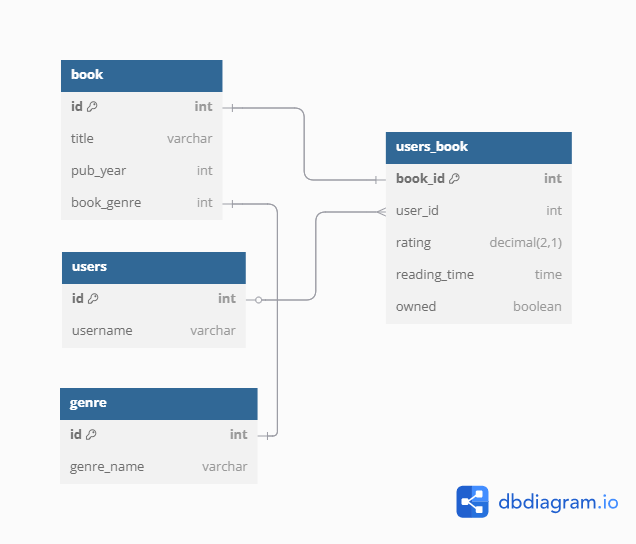
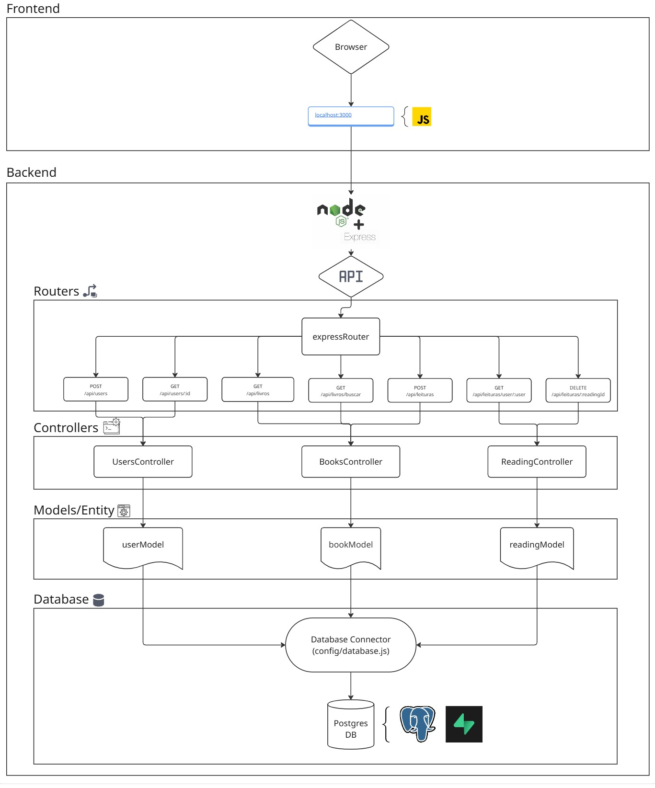

# Web Application Document - Projeto Individual - Módulo 2 - Inteli

## Laços de Leitura

#### Anny Jhulia Cerazi

## Sumário

1. [Introdução](#c1)  
2. [Visão Geral da Aplicação Web](#c2)  
3. [Projeto Técnico da Aplicação Web](#c3)  
4. [Desenvolvimento da Aplicação Web](#c4)  
5. [Referências](#c5)  

 

## 1. Introdução

&emsp;*Laços de Leitura- é uma aplicação web que permite a criação de uma biblioteca virtual pessoal para registro de leituras realizadas de obras de Clarice Lispector. A partir do momento em que o usuário adiciona o livro em sua biblioteca, pode registrar a nota que daria para o livro e sua leitura, além do tempo que levou e, também, se possui o livro físico ou não.
&emsp;O sistema se baseia na integração de um banco de dados em uma aplicação web, com back-end feito em JavaScript e front-end em CSS e HTML.

---

## 2. Visão Geral da Aplicação Web

### 2.1 Objetivo da Aplicação

Laços de Leitura é uma aplicação web que permite aos usuários criar e gerenciar uma biblioteca virtual pessoal focada nas obras de Clarice Lispector. A aplicação possibilita:

- Visualizar o catálogo completo de obras da autora
- Adicionar livros à biblioteca pessoal
- Registrar avaliações (notas) para cada leitura
- Documentar o tempo dedicado à leitura de cada obra
- Indicar se possui o livro em formato físico
- Adicionar notas e impressões pessoais sobre cada leitura

### 2.2 Público-Alvo

A aplicação é destinada principalmente a:
- Estudantes de literatura brasileira
- Admiradores da obra de Clarice Lispector
- Professores e pesquisadores de literatura
- Leitores que desejam organizar suas experiências de leitura

### 2.3 Funcionalidades Principais

1. **Gerenciamento de Usuários**
   - Criação de perfil de usuário
   - Visualização de perfil

2. **Catálogo de Livros**
   - Listagem completa das obras de Clarice Lispector
   - Busca de livros por título
   - Visualização de detalhes de cada obra

3. **Biblioteca Pessoal**
   - Adição de livros à biblioteca do usuário
   - Registro de avaliações (notas de 1 a 10)
   - Registro do tempo de leitura
   - Indicação de posse do livro físico
   - Adição de notas pessoais sobre a leitura
   - Remoção de livros da biblioteca pessoal

---

## 3. Projeto da Aplicação Web

### 3.1. Modelagem do banco de dados

### 3.1.1 BD e Models (Semana 5)

#### 3.1.1.1. Model User

Responsabilidade: Gerenciar dados da tabela users

Métodos:
- GETAll(): Retorna todos os usuários ordenados por username
- GETById(id): Busca um usuário específico pelo ID
- create(data): Cria novo usuário
- update(id, data): Atualiza username de um usuário
- delete(id): Remove usuário

Métodos auxiliares:
- GETByUsername(username): Busca usuário pelo nome
- exists(id): Verifica se usuário existe

#### 3.1.1.2. Model Book
Responsabilidade: Gerenciar dados da tabela book e suas relações com gêneros

Métodos:
- GETAll(): Lista todos os livros com nome do gênero
- GETById(id): Busca livro específico com dados do gênero
- create(data): Adiciona novo livro
- update(id, data): Atualiza dados do livro
- delete(id): Remove livro
- searchByTitle(title): Busca livros por título
- GETByGenre(genreId): Retorna todos os livros de um gênero específico

Métodos auxiliares:
- exists(id): Verifica se livro existe

#### 3.1.1.3. Model Reading
Responsabilidade: Gerenciar dados da tabela users_book (relacionamento entre usuários e livros)

Métodos:
- GETAll(): Todas as leituras com dados de usuário, livro e gênero
- create(data): Cria nova leitura
- update(userId, bookId, data): Atualiza leitura específica
- delete(userId, bookId): Remove leitura específica
- GETByUser(userId): Todas as leituras de um usuário com dados dos livros
- GETByBook(bookId): Todos os usuários que leram um livro específico
- GETByUserAndBook(userId, bookId): Leitura específica de um usuário para um livro

Métodos auxiliares:
- exists(userId, bookId): Verifica se já existe leitura para este par usuário-livro
- deleteByBookId(bookId): Remove todas as leituras de um livro

### 3.2. Arquitetura

Esse diagrama representa a arquitetura MVC (Model-View-Controller) de uma aplicação web com backend em Node.js + Express e banco de dados PostgreSQL.

### Funcionamento entre as camadas:

#### Frontend

- O navegador (Browser) acessa a aplicação via `localhost:3000` usando JavaScript para interagir com a API backend.

#### Backend (Node.js + Express)

- A requisição é enviada para a API.
- Os endpoints são definidos nas rotas.
- As rotas chamam os controllers (`UsersController`, `BooksController`, `ReadingController`), que contêm a lógica de negócio.
- Os controllers interagem com os models (`userModel`, `bookModel`, `readingModel`), responsáveis pela comunicação com o banco de dados.
- Os models usam um conector de banco (`config/database.js`) para executar queries no PostgreSQL.

### Camadas:

- Rotas: definem os caminhos da API.
- Controllers: tratam a lógica de negócio.
- Models: fazem a interface com o banco.
- Database: armazena os dados de usuários, livros e leituras.

Essa estrutura separa responsabilidades, facilita manutenção e escalabilidade.

### 3.6. WebAPI e endpoints 

#### 3.6.1. Rotas de Usuários

- POST /api/users - Cria um novo usuário no sistema
- GET /api/users/:id - Busca e retorna o perfil de um usuário específico pelo ID

#### 3.6.2. Rotas de Livros

- GET /api/livros - Lista todos os livros disponíveis no sistema
- GET /api/livros/buscar - Permite buscar livros específicos (provavelmente por título, autor, etc.)

#### 3.6.3. Rotas de Leituras

- POST /api/leituras - Registra uma nova leitura (quando um usuário começa/termina um livro)
- GET /api/leituras/user/:userId - Busca todas as leituras de um usuário específico
- DELETE /api/leituras/:readingId - Remove um registro de leitura específico

### 3.7 Interface e Navegação

A interface do Laços de Leitura foi desenvolvida com foco na experiência do usuário, utilizando um design inspirado em elementos vintage de biblioteca e papéis antigos, criando uma atmosfera que remete ao universo literário de Clarice Lispector.

#### 3.7.1 Página Principal

A página principal da aplicação apresenta:

- **Cabeçalho**: Título da aplicação e uma citação de Clarice Lispector
- **Formulário de Adição**: Permite adicionar novas leituras à biblioteca pessoal
- **Biblioteca Virtual**: Exibe cards dos livros adicionados pelo usuário
- **Informações sobre a Autora**: Breve biografia de Clarice Lispector

#### 3.7.2 Elementos de Design

- **Paleta de Cores**: Tons terrosos e sépia que remetem a livros antigos e papel envelhecido
- **Tipografia**: Utilização de fontes serifadas (Crimson Text e Playfair Display) que evocam textos literários clássicos
- **Cards de Livros**: Apresentação visual dos livros com efeito de lombada e sombras suaves
- **Efeitos de Hover**: Animações sutis ao passar o mouse sobre elementos interativos

#### 3.7.3 Responsividade

A interface foi desenvolvida com CSS responsivo, adaptando-se a diferentes tamanhos de tela:
- Layout em grid para telas maiores
- Layout em coluna única para dispositivos móveis
- Ajustes de tamanho de fonte e espaçamento conforme o dispositivo

#### 3.7.4 Interações

- **Adição de Livros**: Formulário com validação de dados
- **Visualização de Biblioteca**: Cards com informações detalhadas sobre cada leitura
- **Remoção de Livros**: Botão para remover livros da biblioteca pessoal
- **Feedback Visual**: Mensagens de sucesso ou erro após operações

---

## 4. Desenvolvimento da Aplicação Web

### 4.1 Demonstração do Sistema Web

*VIDEO: [Link para o vídeo demonstrativo será inserido aqui]*

O sistema web Laços de Leitura foi desenvolvido seguindo a arquitetura MVC (Model-View-Controller) com Node.js e Express no backend, PostgreSQL como banco de dados, e HTML, CSS e JavaScript no frontend.

#### 4.1.1 Backend

O backend da aplicação foi implementado com:

- **Node.js e Express**: Para criar o servidor e gerenciar as rotas da API
- **PostgreSQL**: Banco de dados relacional para armazenar informações sobre usuários, livros e leituras
- **Arquitetura MVC**: Separação clara entre modelos, visualizações e controladores

Os principais componentes do backend incluem:

1. **Models**: Classes que interagem diretamente com o banco de dados
   - `userModel.js`: Gerencia dados de usuários
   - `bookModel.js`: Gerencia dados de livros e suas relações com gêneros
   - `readingModel.js`: Gerencia dados de leituras (relação entre usuários e livros)

2. **Controllers**: Implementam a lógica de negócio
   - `UsersController`: Gerencia operações relacionadas a usuários
   - `BooksController`: Gerencia operações relacionadas a livros
   - `ReadingController`: Gerencia operações relacionadas a leituras

3. **Routes**: Define os endpoints da API
   - Rotas para gerenciamento de usuários
   - Rotas para acesso ao catálogo de livros
   - Rotas para gerenciamento de leituras

#### 4.1.2 Frontend

O frontend foi desenvolvido com:

- **HTML/EJS**: Para estruturação das páginas
- **CSS**: Para estilização com foco em uma experiência visual que remete a livros antigos
- **JavaScript**: Para interações dinâmicas com a API

Principais características do frontend:

1. **Página Inicial**: Interface principal que integra todas as funcionalidades
2. **Formulário de Adição**: Permite adicionar novas leituras à biblioteca
3. **Visualização em Grid**: Exibe os livros da biblioteca pessoal em formato de cards
4. **Responsividade**: Adaptação a diferentes tamanhos de tela

#### 4.1.3 Integração

A integração entre frontend e backend é realizada através de chamadas AJAX para a API REST, permitindo:

- Carregamento dinâmico de livros disponíveis
- Adição de novas leituras sem recarregar a página
- Remoção de leituras com atualização instantânea da interface
- Feedback visual para o usuário após operações

### 4.2 Conclusões e Trabalhos Futuros

#### 4.2.1 Pontos Fortes

1. **Arquitetura MVC bem definida**: A separação clara entre modelos, visualizações e controladores facilita a manutenção e evolução do código.

2. **Design temático coerente**: A interface remete ao universo literário de Clarice Lispector, criando uma experiência imersiva para os usuários.

3. **Banco de dados relacional bem estruturado**: O modelo de dados permite relacionamentos claros entre usuários, livros e leituras.

4. **API RESTful**: Os endpoints seguem boas práticas de design de API, facilitando integrações futuras.

5. **Experiência de usuário fluida**: As interações são intuitivas e o feedback visual é claro.

#### 4.2.2 Pontos a Melhorar

1. **Autenticação de usuários**: Implementar um sistema completo de autenticação com login/logout e níveis de acesso.

2. **Testes automatizados**: Aumentar a cobertura de testes unitários e de integração.

3. **Documentação da API**: Criar uma documentação mais detalhada dos endpoints.

4. **Otimização de performance**: Implementar cache para consultas frequentes ao banco de dados.

5. **Acessibilidade**: Melhorar a conformidade com diretrizes WCAG para tornar a aplicação mais acessível.

#### 4.2.3 Melhorias Futuras

1. **Sistema de recomendação**: Implementar algoritmo que sugere obras com base nas preferências do usuário.

2. **Integração com redes sociais**: Permitir compartilhamento de leituras e avaliações em plataformas sociais.

3. **Grupos de leitura**: Criar funcionalidade para usuários formarem clubes de leitura virtuais.

4. **Estatísticas de leitura**: Desenvolver dashboard com visualizações gráficas dos hábitos de leitura.

5. **Versão mobile**: Desenvolver aplicativo nativo para dispositivos móveis.

6. **Expansão do catálogo**: Incluir obras de outros autores brasileiros, expandindo o escopo da aplicação.

7. **Citações favoritas**: Permitir que usuários salvem e compartilhem trechos favoritos das obras.

8. **Modo offline**: Implementar funcionalidade de uso offline com sincronização posterior.

Este projeto estabelece uma base sólida para uma aplicação de gerenciamento de biblioteca pessoal, com potencial para expansão em diversas direções, mantendo o foco na experiência literária e na valorização da obra de Clarice Lispector.

## 5. Referências

1. LISPECTOR, Clarice. Obras completas. Rio de Janeiro: Rocco, 2019.

2. MDN Web Docs. JavaScript. Disponível em: <https://developer.mozilla.org/pt-BR/docs/Web/JavaScript>. Acesso em: maio 2025.

3. Node.js Documentation. Disponível em: <https://nodejs.org/en/docs/>. Acesso em: maio 2025.

4. Express.js Documentation. Disponível em: <https://expressjs.com/pt-br/>. Acesso em: maio 2025.

5. PostgreSQL Documentation. Disponível em: <https://www.postgresql.org/docs/>. Acesso em: maio 2025.

6. EJS Documentation. Disponível em: <https://ejs.co/>. Acesso em: maio 2025.

7. FOWLER, Martin. Patterns of Enterprise Application Architecture. Addison-Wesley Professional, 2002.

8. GAMMA, Erich et al. Design Patterns: Elements of Reusable Object-Oriented Software. Addison-Wesley Professional, 1994.

9. MOREIRA FILHO, Tristão; NEMER, Sylvia Regina Bastos. Clarice Lispector: uma literatura pensante. São Paulo: Edusp, 2012.

10. GOTLIB, Nádia Battella. Clarice: uma vida que se conta. São Paulo: Edusp, 2013.
